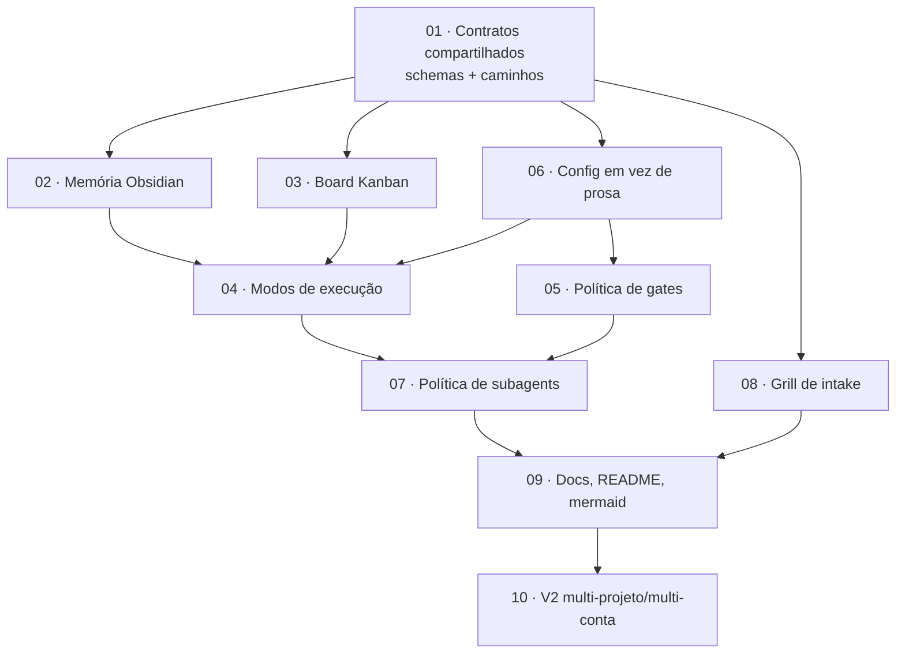

# Ailfred v0.2 — Plano de upgrade (mapa de execução)

> Este diretório **não é documentação do produto**. É um pacote de *prompts de construção*.
> Cada arquivo `NN-prompt-*.md` foi escrito para ser colado inteiro numa **janela de contexto
> nova e limpa** de um agente de codificação, sem depender de nenhuma conversa anterior.

## Por que existe

Ailfred v0.1 faz PRD → steps → tasks → execução sequencial ou em worktrees. O que falta:

| Lacuna | Efeito hoje | Resolvido em |
| --- | --- | --- |
| Nenhuma memória por repositório | todo goal recomeça do zero; scan de capacidades repetido | `02` |
| Backlog é lista de arquivos, não board | não dá pra ver fluxo, WIP nem bloqueio | `03` |
| Um único modo de execução implícito | loop, grafo e task única forçados no mesmo molde | `04` |
| Gates sempre presumem dev no loop | task trivial paga pedágio de 4 aprovações | `05` |
| Configuração só em `.md` | host precisa *ler prosa* pra decidir; caro em token | `06` |
| Subagent por reflexo | 4 spawns pra mudar um arquivo | `07` |
| Intake aceita pedido vago | PRD nasce em cima de suposição | `08` |
| README extenso, sem diagrama | curva de adoção alta | `09` |
| Um projeto por vez | sem visão multi-repo / multi-conta | `10` |

## Ordem de execução

**Regra dura:** `01` é pré-requisito de todos. `02`, `03`, `06` e `08` podem rodar em
paralelo (janelas independentes). `04` só depois de `02`+`03`+`06`. `09` só depois de
tudo que ele documenta. `10` é v2 — não bloqueia release do v0.2.

## Um arquivo, uma janela

| # | Arquivo | Escopo (arquivos que ele cria/edita) | Paralelizável com |
| --- | --- | --- | --- |
| 01 | `01-shared-contracts.md` | referência — **não edita nada** | — |
| 02 | `02-prompt-memory-obsidian.md` | `skills/ailfred-memory/`, `scripts/ailfred-memory-*.sh`, `templates/ailfred/memory/` | 03, 06, 08 |
| 03 | `03-prompt-kanban-board.md` | `scripts/ailfred-board.sh`, `templates/ailfred/board.yaml`, `commands/ailfred-status.md` | 02, 06, 08 |
| 04 | `04-prompt-execution-modes.md` | `skills/ailfred-execution-modes/`, `agents/ailfred-loop-runner.md`, `agents/ailfred-graph-runner.md`, `commands/ailfred-execute.md` | — |
| 05 | `05-prompt-validation-policy.md` | `skills/ailfred-gate-policy/`, `templates/ailfred/state.yaml`, `commands/ailfred.md` | 07 |
| 06 | `06-prompt-config-over-prose.md` | `templates/ailfred/config.yaml`, `scripts/ailfred-config.sh`, `scripts/ailfred-route.sh` | 02, 03, 08 |
| 07 | `07-prompt-subagent-policy.md` | `skills/ailfred-delegation/`, edits nos 4 agents | 05 |
| 08 | `08-prompt-grill-intake.md` | `skills/ailfred-grill/`, `agents/ailfred-architect.md` | 02, 03, 06 |
| 09 | `09-prompt-docs-and-readme.md` | `README.md`, `docs/`, `CONTRIBUTING.md` | — |
| 10 | `10-prompt-v2-multiproject.md` | `commands/ailfred-projects.md`, `scripts/ailfred-registry.sh` | — |

## Invariantes que nenhum prompt pode quebrar

1. **Host é escritor único de `state.yaml` e `board.yaml`.** Subagent devolve handoff; host aplica.
2. **`ailfred-architect` é escritor único de `PRD.md`, `plan.md`, `tasks/*.md`.**
3. **Nenhum gate presumido.** Sem token no `state.yaml`, próximo passo não roda — *exceto*
   nos modos que o `05` declara sem gate, e mesmo lá a decisão fica registrada.
4. **Plugin autocontido.** Nada instalado fora de `${CLAUDE_PLUGIN_ROOT}`, salvo o runtime do
   goal (`.claude/ailfred/<slug>/` no projeto) e a memória (`~/.claude/ailfred/`).
5. **Idioma:** arquivos de instrução do plugin em inglês; saída ao dev e runtime em português.
6. **Custo primeiro.** Toda decisão de rota prefere: config lida por script > prosa lida por
   modelo; host inline > subagent; um subagent > vários.

## Definição de pronto do pacote inteiro

- [ ] `/ailfred` num repo novo cria memória e board sem pergunta extra
- [ ] `/ailfred-execute` escolhe modo por config, não por adivinhação
- [ ] Task única e trivial fecha com **no máximo 1** interação humana
- [ ] `README.md` cabe em uma tela de scroll e tem diagrama mermaid do fluxo
- [ ] Nenhum arquivo `.md` novo é lido pelo host em fluxo simples (só config)
