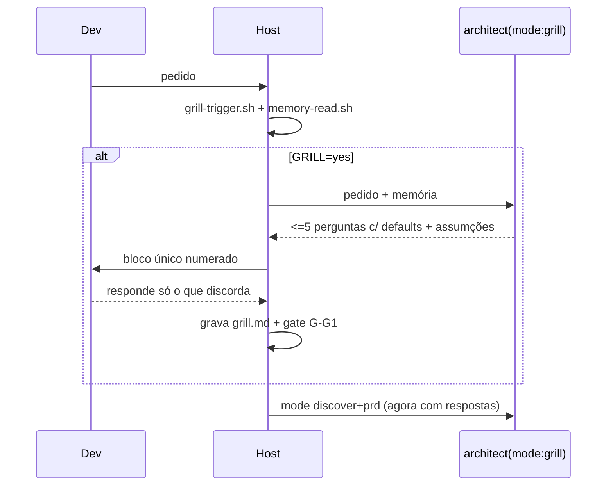

# 08 · Prompt — Grill de intake (entender antes de planejar)

> Janela limpa. Cole `01-shared-contracts.md` antes deste arquivo.

## Missão

Colocar uma fase de **grill** — interrogatório curto e adversarial — entre o pedido do dev
e o PRD, para que o Ailfred nunca planeje em cima de um pedido vago.

## Problema concreto

"Melhora o dashboard" hoje vira PRD com critérios inventados pelo architect. O dev descobre
o desalinhamento no G-G2, depois de o architect já ter gasto uma janela inteira.

## O que é grill aqui

Não é "faça perguntas". É pressão dirigida a **cinco pontos de falha**, no máximo 5
perguntas, todas com assumção default para o dev responder só o que discorda:

| Eixo | Pergunta busca | Exemplo de falha que evita |
| --- | --- | --- |
| **Resultado** | como saberemos que terminou? qual comando/observação prova? | "melhorar" sem critério |
| **Fronteira** | o que explicitamente **não** entra? | escopo estourando na execução |
| **Restrição** | o que não pode quebrar? compat, perf, contrato público | regressão silenciosa |
| **Prioridade** | se só metade couber, qual metade? | entrega errada primeiro |
| **Prova** | quem/o que valida? teste, dev, staging? | "pronto" sem evidência |

Regras:
- **Máximo 5 perguntas**, em bloco único, numeradas, cada uma com `[assumo: X]`.
- Pergunta que o dev já respondeu no pedido **não** é feita. Grill que repete o óbvio queima confiança.
- Pergunta cuja resposta está na **memória do repo** (prompt 02) não é feita — é assumida
  citando a nota: `[assumo: pnpm, per [[build-usa-pnpm]]]`.
- Grill **não** propõe solução. Ele só reduz ambiguidade.

## Quando roda (`discovery.grill`)

| Valor | Comportamento |
| --- | --- |
| `auto` (default) | roda quando o pedido tem < 25 palavras, OU não tem critério verificável, OU é modo lista com > 8 itens |
| `always` | sempre |
| `never` | nunca; assume tudo e registra as assumções |

Em `validation: autonomous` (prompt 05), o grill ainda **roda**, mas só interrompe se
alguma pergunta for `blocking`; o resto vira assumção registrada. Grill barato é assumção
explícita, não silêncio.

## Escopo — arquivos que você cria

```
skills/ailfred-grill/SKILL.md
scripts/ailfred-grill-trigger.sh   # decide se roda: stdout GRILL=yes|no reason=...
templates/ailfred/grill.md         # registro das perguntas, respostas e assumções
```

E **edita**: `agents/ailfred-architect.md` (ganha `mode: grill`, anterior a
`discover+prd`), `commands/ailfred.md` (novo passo + gate `G-G1-grill`),
`skills/ailfred-list-intake/SKILL.md` (triagem passa a alimentar o grill em vez de
perguntar solto).

## Fluxo



Note: **uma** ida ao dev. Não faça grill em rodadas — segunda rodada só se a resposta
abrir contradição direta, e nesse caso no máximo 2 perguntas.

## Reuso

Existe uma skill `mattpocock-skills:grilling` instalada na máquina do usuário. Leia-a antes
de escrever a sua e **reuse o que servir** (postura adversarial, formato de pergunta). Não
copie: o grill do Ailfred é curto, com teto e com defaults, porque alimenta um pipeline
automatizado. Se a skill externa estiver disponível em runtime, o SKILL pode delegar a ela
o *estilo* e manter aqui o *contrato de saída*.

## Contrato de saída do `mode: grill`

```yaml
questions:
  - { n: 1, text: "...", axis: resultado|fronteira|restricao|prioridade|prova,
      kind: blocking|assumable, default: "...", source: null | "[[nota-da-memoria]]" }
assumptions: [{ text: "...", source: "memoria|pedido|convencao" }]
ready_for_prd: true | false
```

`ready_for_prd: false` só é aceitável se houver ao menos uma pergunta `blocking`.

## Definição de pronto

- [ ] Pedido detalhado (> 25 palavras, com critério) → `GRILL=no`, zero perguntas
- [ ] Pedido vago → exatamente ≤ 5 perguntas, todas com default
- [ ] Pergunta respondível pela memória vira assumção citando a nota, não pergunta
- [ ] `grill.md` registra perguntas, respostas e assumções não confirmadas
- [ ] Em `autonomous`, grill não interrompe salvo pergunta `blocking`
