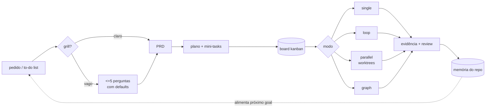
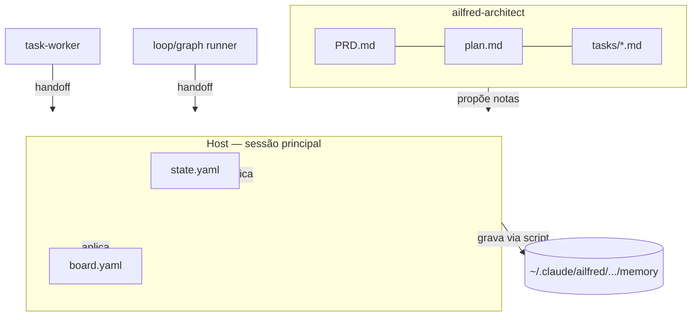

# 09 · Prompt — Documentação: README conciso + guias internos + mermaid

> Janela limpa. Cole `01-shared-contracts.md` antes deste arquivo.
> Rode **por último** (exceto o 10): documenta o que os prompts 02–08 entregaram.
> Antes de escrever, leia o repositório como ele está agora — não confie neste plano
> quanto a detalhes de implementação; confie no código.

## Missão

Duas audiências, dois conjuntos de documento, sem sobreposição:

| Audiência | Onde | Pergunta que responde | Teto |
| --- | --- | --- | --- |
| **Quem usa** | `README.md` | como instalo e uso em 2 minutos | ≤ 120 linhas |
| **Quem mantém** | `docs/` + `CONTRIBUTING.md` | como isso funciona por dentro e como estendo | sem teto |

## `README.md` — estrutura obrigatória

1. **Uma frase** do que é. Sem adjetivo.
2. **Instalação** — bloco de comando do marketplace, 3 linhas.
3. **Diagrama do fluxo** (mermaid, abaixo).
4. **Uso em 60 segundos** — um exemplo real, entrada e saída resumida.
5. **Os quatro modos** — tabela de 4 linhas, uma frase cada.
6. **Comandos** — tabela: comando, para quê, exemplo.
7. **Onde ficam as coisas** — 6 linhas de árvore (runtime no projeto, memória em `~`).
8. **Configuração** — 5 chaves mais usadas + link para `docs/config-reference.md`.
9. **Links** para `docs/`.

Corte tudo que não estiver nessa lista. Doutrina, invariantes e racional vão para `docs/`.

## Diagramas mermaid obrigatórios

**README — fluxo principal:**



**`docs/architecture.md` — quem escreve o quê** (o invariante mais importante do projeto):



**`docs/execution-modes.md`** — um diagrama por modo (estado do loop; DAG do graph).

Regra de diagrama: mostra **mecanismo**, não decoração. Se o diagrama só repete a lista
que está ao lado dele, apague o diagrama.

## `docs/` — arquivos

```
docs/architecture.md        # invariantes, quem escreve o quê, ciclo de vida do goal
docs/execution-modes.md     # os 4 modos, seleção determinística, quando cada um falha
docs/memory.md              # schema das notas, o que nunca entra, como podar o vault
docs/board.md               # colunas, transições, WIP, comandos do board.sh
docs/config-reference.md    # já criado no prompt 06 — revise e complete
docs/extending.md           # como adicionar um modo, um agent, um script
docs/troubleshooting.md     # sintoma -> causa -> comando, em tabela
CONTRIBUTING.md             # setup local, testes, estilo, checklist de PR
```

## Guias dentro do projeto do usuário

Quando `/ailfred` roda pela primeira vez num repo, ele escreve **um** arquivo curto em
`.claude/ailfred/README.md` (≤ 30 linhas) explicando ao time o que são aqueles arquivos e
o que é seguro editar à mão. Um arquivo, não uma pasta de docs.

## Estilo

- Português no README e em `docs/` (audiência é o time do usuário); arquivos de instrução
  do plugin seguem em inglês.
- Tabela > parágrafo. Comando exato > descrição.
- Todo bloco de código é colável e verdadeiro. Se você não rodou, não cole.
- Sem "poderoso", "robusto", "simplesmente".

## Definição de pronto

- [ ] `README.md` ≤ 120 linhas e contém o diagrama de fluxo
- [ ] Todo mermaid renderiza (valide sintaxe; nada de nó órfão ou seta quebrada)
- [ ] Todo comando citado existe no repo (varra `scripts/` e `commands/` e confira um a um)
- [ ] `docs/troubleshooting.md` cobre ≥ 8 sintomas reais, com comando de diagnóstico
- [ ] Nenhuma doutrina duplicada entre `README.md`, `docs/` e `skills/*/SKILL.md`
- [ ] `.claude/ailfred/README.md` gerado no scaffold, ≤ 30 linhas
